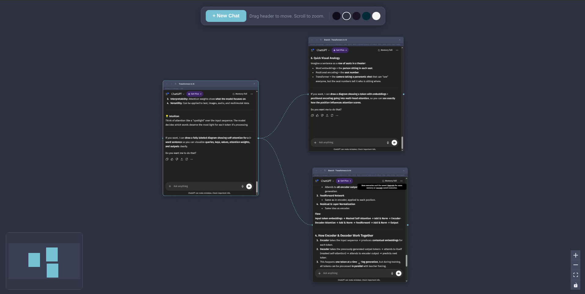

# Chat Nodes Canvas

> Infinite canvas for AI chatbot conversation branching

<p align="center">
  
</p>

**Chat Nodes Canvas** is a free, open-source desktop app that lets you branch, explore, and visualize your ChatGPT conversations on an infinite canvas. When ChatGPT opens a new chat branch, it automatically appears as a connected node — so you can see your entire thought process at a glance.

## Features

- **Infinite Canvas** — Pan, zoom, and navigate freely. No boundaries.
- **Auto Branching** — ChatGPT's "branch in new chat" creates a new node automatically, connected to its parent.
- **Real ChatGPT Inside** — Each node embeds a full ChatGPT session with your own account.
- **Visual Connections** — Animated edges show relationships between parent and branched conversations.
- **5 Themes** — Midnight, Nord, Rosé Pine, Solarized Dark, and Light.
- **Cross Platform** — Runs natively on Windows, macOS, and Linux.

## Download

| Platform | Format | Link |
|----------|--------|------|
| Windows  | `.exe` installer | [Latest Release](https://github.com/kaleab-ayenew/chat-nodes-canvas/releases/latest) |
| macOS    | `.dmg` (Intel + Apple Silicon) | [Latest Release](https://github.com/kaleab-ayenew/chat-nodes-canvas/releases/latest) |
| Linux    | `.AppImage` / `.deb` | [Latest Release](https://github.com/kaleab-ayenew/chat-nodes-canvas/releases/latest) |

Or visit the [Releases page](https://github.com/kaleab-ayenew/chat-nodes-canvas/releases) for all versions.

## Development

### Prerequisites

- [Node.js](https://nodejs.org/) 20+
- npm

### Setup

```bash
# Clone the repo
git clone https://github.com/kaleab-ayenew/chat-nodes-canvas.git
cd chat-nodes-canvas

# Install dependencies
npm install

# Start in development mode
npm run dev
```

### Build

```bash
# Build for production
npm run build

# Package for your platform
npm run dist

# Package for a specific platform
npm run dist:win
npm run dist:mac
npm run dist:linux
```

## Tech Stack

- [Electron](https://www.electronjs.org/) — Desktop app framework
- [React](https://react.dev/) — UI library
- [React Flow](https://reactflow.dev/) — Node-based canvas
- [electron-vite](https://electron-vite.org/) — Build tool
- [electron-builder](https://www.electron.build/) — Packaging & distribution

## How It Works

1. The app creates a main Electron window with a React + React Flow canvas.
2. Each node contains a `<webview>` tag pointing to `chatgpt.com`.
3. When a webview tries to open a new window (e.g., "Branch in new chat"), the app intercepts it and creates a new node on the canvas instead, connected to the source node with an animated edge.
4. Webview-to-node mapping is maintained so branches always connect to the correct parent.

## Creating a Release

Releases are automated via GitHub Actions. To create a new release:

```bash
# Tag the version
git tag v1.0.0

# Push the tag
git push origin v1.0.0
```

This triggers the CI pipeline which builds for Windows, macOS, and Linux, then creates a GitHub Release with all the artifacts.

## License

[MIT](LICENSE)
